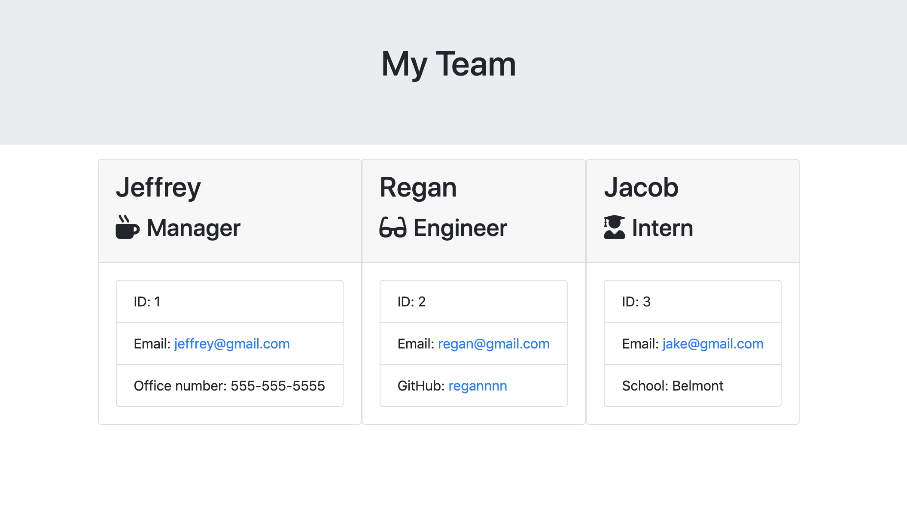

# <div align="center">Employee Card Generator</div>

## 💪 About

This node.js application uses inquirer to build employee cards for your work team! Simply answer the questions in your command line and continue to add as many employees as you would like. After you define the role of your employee, another set of questions will be asked more specific to their role. After each question is answered, new employee cards will be dynamically written to the designated html file.

***
## Preview




***
## Table of Contents
1. [Install](#install)
2. [Usage](#usage)
3. [Technologies and Languages Used](#technologies-and-languages-used)
3. [License](#license)
4. [Contributing](#contributing)
5. [Contact Me](#contact-me)

***
## Install

To install dependencies in this app, clone this repo and run 
```
npm install
```

***
## Usage

To use this app, simply run
```
node app.js
```
in the vs terminal. 
Answer the inquirer prompts to give information about each employee on your team. Then open up the team.html page to see your dynamically created employee cards.

***
## Technologies and Languages Used
* Javascript
* Node.js
* Inquirer.js
* Bootstrap
* Jest
* HTML

***
## License


***
## Contributing

jeffreymcfarland

***
## Contact Me    

<kbd></kbd> 

* [jlmcfarlandj@gmail.com](mailto:jlmcfarlandj@gmail.com)

* [linkedin.com/in/jeffrey-mcfarland](https://www.linkedin.com/in/jeffrey-mcfarland-2659b116a/)

